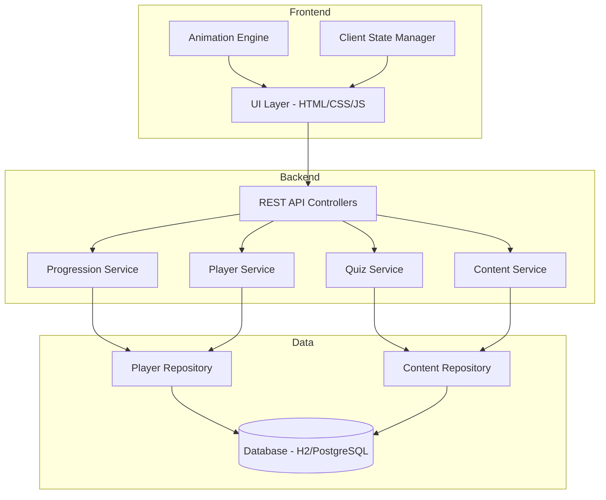
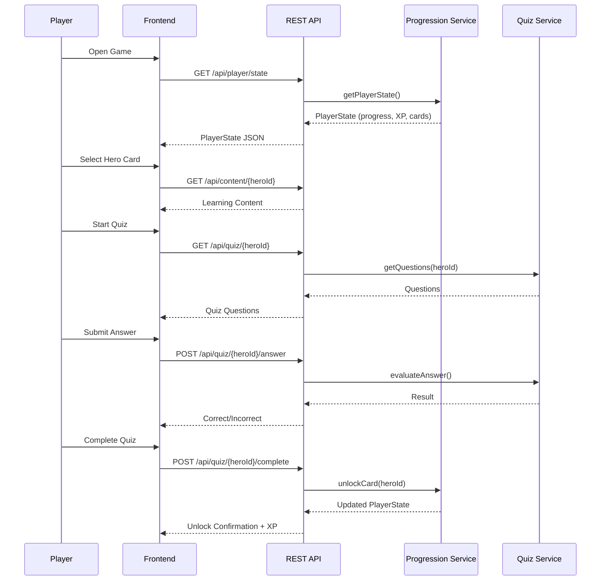

# Design Document

## Overview

Java Hero Cards is a gamified learning application built as a Spring Boot backend with a reactive frontend. The system teaches Java and Spring concepts through collectible hero cards organized in progressive learning paths. Players move through four tiers (Bronze, Silver, Gold, Spring Master), unlocking cards by studying concept content and passing multiple-choice quizzes.

The application follows a client-server architecture where the backend manages game state, progression logic, and content delivery, while the frontend handles animations, card rendering, and interactive UI elements.

### Key Design Decisions

1. **Spring Boot Backend**: Aligns with the educational theme — players learn Spring while using a Spring-powered application. Provides REST APIs for game state management.
2. **Local Storage + Server Persistence**: Player progress persists via REST API to a database, with local session state as a fallback for network failures.
3. **Static Content Model**: Hero card content (explanations, code examples, quiz questions) is stored as structured data in the database, allowing content updates without code changes.
4. **Sequential Progression Enforcement**: Progression logic lives server-side to prevent bypassing locked content.

## Architecture



### Component Interaction Flow



## Components and Interfaces

### Backend Components

#### PlayerController
- `GET /api/player/state` — Returns full player state (progress, XP, unlocked cards, onboarding status)
- `POST /api/player/onboarding/complete` — Marks onboarding as completed
- `GET /api/player/collection` — Returns all unlocked hero cards with details

#### ContentController
- `GET /api/content/{heroId}` — Returns learning content for a specific hero card
- `GET /api/paths` — Returns all learning paths with their hero cards and lock status

#### QuizController
- `GET /api/quiz/{heroId}` — Returns quiz questions for a hero card
- `POST /api/quiz/{heroId}/answer` — Evaluates a single answer, returns correct/incorrect
- `POST /api/quiz/{heroId}/complete` — Marks quiz as passed, triggers progression

#### ProgressionService
- `getPlayerState(playerId)` — Retrieves current player state
- `unlockCard(playerId, heroId)` — Unlocks a card, awards XP, updates progression
- `getNextAvailableHero(playerId)` — Determines the next hero to learn
- `isHeroAccessible(playerId, heroId)` — Checks if a hero is accessible to the player
- `completeOnboarding(playerId)` — Marks onboarding as done

#### QuizService
- `getQuestions(heroId)` — Returns 3-5 questions for a hero card
- `evaluateAnswer(heroId, questionId, answerId)` — Checks if answer is correct
- `isQuizComplete(playerId, heroId)` — Checks if all questions answered correctly

#### ContentService
- `getHeroContent(heroId)` — Returns structured learning content
- `getLearningPaths()` — Returns all paths with hero metadata
- `getPathProgress(playerId, pathId)` — Returns progress within a path

### Frontend Components

#### OnboardingView
- Plays three sequential animations
- Provides skip control
- Navigates to Roadmap on completion

#### RoadmapView
- Displays four learning paths with hero card states (locked/active/completed)
- Shows total XP
- Highlights next available hero

#### LearningView
- Displays intro animation (max 5 seconds)
- Shows concept explanation in three sections
- Displays code examples
- Provides "Start Quiz" button

#### QuizView
- Presents questions one at a time
- Shows answer options (3-4 per question)
- Provides immediate feedback (correct/incorrect)
- Allows unlimited retries on incorrect answers

#### CardUnlockView
- Plays flip and shine animation (max 3 seconds)
- Shows unlock confirmation
- Displays XP earned

#### CollectionView
- Grid display of unlocked cards
- Card flip animation on select
- Zoom/enlarged view
- Filter by learning path
- Set completion badges
- Progress indicators per path

## Data Models

### Player
```java
public class Player {
    private Long id;
    private String username;
    private int totalExperiencePoints;
    private boolean onboardingCompleted;
    private LearningPath currentPath;
    private Set<String> unlockedHeroIds;
    private LocalDateTime createdAt;
    private LocalDateTime lastUpdatedAt;
}
```

### HeroCard
```java
public class HeroCard {
    private String id;
    private String name;
    private String conceptTitle;
    private LearningPath learningPath;
    private int orderInPath;
    private HeroContent content;
}
```

### HeroContent
```java
public class HeroContent {
    private String heroId;
    private String whatItIs;
    private String whyItMatters;
    private String howToUseIt;
    private List<CodeExample> codeExamples;
    private String animationUrl;
}
```

### CodeExample
```java
public class CodeExample {
    private String title;
    private String code;
    private String language; // always "java"
}
```

### QuizQuestion
```java
public class QuizQuestion {
    private String id;
    private String heroId;
    private String questionText;
    private List<AnswerOption> options;
    private String correctOptionId;
}
```

### AnswerOption
```java
public class AnswerOption {
    private String id;
    private String text;
}
```

### LearningPath (Enum)
```java
public enum LearningPath {
    BRONZE(1, 10),
    SILVER(2, 20),
    GOLD(3, 30),
    SPRING_MASTER(4, 50);

    private final int order;
    private final int xpPerCard;

    LearningPath(int order, int xpPerCard) {
        this.order = order;
        this.xpPerCard = xpPerCard;
    }
}
```

### PlayerState (DTO)
```java
public class PlayerState {
    private Long playerId;
    private int totalExperiencePoints;
    private boolean onboardingCompleted;
    private LearningPath currentPath;
    private Set<String> unlockedHeroIds;
    private String nextAvailableHeroId;
    private Map<LearningPath, PathProgress> pathProgressMap;
}
```

### PathProgress
```java
public class PathProgress {
    private LearningPath path;
    private int totalCards;
    private int unlockedCards;
    private boolean completed;
}
```


## Correctness Properties

*A property is a characteristic or behavior that should hold true across all valid executions of a system — essentially, a formal statement about what the system should do. Properties serve as the bridge between human-readable specifications and machine-verifiable correctness guarantees.*

### Property 1: Card state rendering consistency

*For any* player state and *for any* hero card in the game, the card's display state SHALL be "completed" if and only if the card is in the player's unlocked set, and "locked" otherwise.

**Validates: Requirements 2.2, 2.3**

### Property 2: Path completion detection

*For any* player state and *for any* learning path, the path SHALL be marked as "completed" if and only if every hero card in that path is present in the player's unlocked set.

**Validates: Requirements 2.4, 7.5**

### Property 3: Next available hero determination

*For any* player state that is not fully complete (not all cards unlocked), there SHALL be exactly one hero card marked as "active", and that card SHALL be the first non-unlocked card in the earliest incomplete learning path.

**Validates: Requirements 2.5**

### Property 4: Sequential progression invariant

*For any* player state and *for any* hero card that is accessible to the player, all preceding hero cards in the same learning path SHALL be in the player's unlocked set. Additionally, no hero card in a learning path beyond the player's current active path SHALL be accessible.

**Validates: Requirements 3.2, 3.4, 6.2, 6.4**

### Property 5: Path transition unlocking

*For any* learning path that is not the final path, when all hero cards in that path are unlocked, the first hero card of the next learning path SHALL be accessible to the player.

**Validates: Requirements 3.3, 6.5**

### Property 6: Hero content structure validity

*For any* hero card in the system, its content SHALL contain all three explanation sections ("What it is", "Why it matters", "How to use it") as non-empty text, and SHALL contain at least one Java code example.

**Validates: Requirements 4.2, 4.3**

### Property 7: Quiz structure validity

*For any* hero card's quiz, the number of questions SHALL be between 3 and 5 inclusive, each question SHALL have between 3 and 4 answer options, and exactly one option per question SHALL be marked as correct.

**Validates: Requirements 5.1, 5.2**

### Property 8: Quiz sequential advancement

*For any* quiz in progress, the next question SHALL only become available after the current question is answered correctly. If an incorrect answer is given, the quiz state SHALL remain on the same question.

**Validates: Requirements 5.4, 5.6**

### Property 9: Quiz completion logic

*For any* quiz where every question has been answered correctly, the quiz state SHALL be marked as "passed".

**Validates: Requirements 5.5**

### Property 10: XP award consistency

*For any* hero card completion event, the experience points awarded SHALL equal the fixed XP value defined for the card's learning path, and this value SHALL be identical for all cards within the same path.

**Validates: Requirements 6.3, 9.3**

### Property 11: Collection filtering correctness

*For any* player collection and *for any* selected path filter, all hero cards returned SHALL belong to the selected learning path. When the filter is "All", every unlocked card SHALL be returned.

**Validates: Requirements 7.4**

### Property 12: Progress calculation accuracy

*For any* player state and *for any* learning path, the progress indicator SHALL show the count of unlocked cards in that path as the numerator and the total defined cards in that path as the denominator, with the ratio matching the actual set intersection.

**Validates: Requirements 7.7**

### Property 13: Player state persistence round-trip

*For any* valid player state, serializing (persisting) the state and then deserializing (restoring) it SHALL produce a player state equivalent to the original, including unlocked hero cards, experience points, current learning path, and onboarding status.

**Validates: Requirements 8.2**

## Error Handling

### Persistence Failures
- **Retry mechanism**: On save failure, the system retries up to 3 times with exponential backoff.
- **User notification**: After all retries fail, display a non-blocking notification informing the player that progress was not saved.
- **Session preservation**: Unsaved progress is retained in the current session state so the player doesn't lose work.

### Animation Failures
- **Graceful degradation**: If an introduction animation fails to load (network error, corrupted asset), the Learning Module skips the animation and proceeds directly to content display.
- **Unlock animation fallback**: If the unlock animation fails, the card is still added to the collection and a static confirmation is shown.

### Content Loading Failures
- **Error states**: If hero card content fails to load, display a retry button with a user-friendly error message.
- **Quiz loading failure**: If quiz questions fail to load, navigate back to the learning view with an error notification.

### Invalid State Recovery
- **Corrupted player state**: If restored player state is inconsistent (e.g., cards unlocked out of order), normalize the state by re-calculating valid progression from the unlocked set.
- **Missing content references**: If a hero card referenced in player state no longer exists in content, exclude it from the collection without crashing.

## Testing Strategy

### Unit Tests
- **ProgressionService**: Test initial state creation, sequential unlocking, path transitions, XP calculations
- **QuizService**: Test answer evaluation, question sequencing, completion detection
- **ContentService**: Test content retrieval, path listing, hero card lookup
- **PlayerState DTO**: Test serialization/deserialization, state validation
- **Collection filtering**: Test filter by path, empty collection handling, progress calculation

### Property-Based Tests (using jqwik)

The project will use [jqwik](https://jqwik.net/) as the property-based testing library for Java.

**Configuration:**
- Minimum 100 iterations per property test
- Each property test references its design document property via tag comment

**Properties to implement:**
- Property 1: Card state rendering consistency — Feature: java-hero-cards, Property 1: Card state matches unlock status
- Property 2: Path completion detection — Feature: java-hero-cards, Property 2: Path completed iff all cards unlocked
- Property 3: Next available hero determination — Feature: java-hero-cards, Property 3: Exactly one active hero in incomplete state
- Property 4: Sequential progression invariant — Feature: java-hero-cards, Property 4: Accessible cards have all predecessors unlocked
- Property 5: Path transition unlocking — Feature: java-hero-cards, Property 5: Completed non-final path unlocks next path
- Property 6: Hero content structure validity — Feature: java-hero-cards, Property 6: All content sections present and non-empty
- Property 7: Quiz structure validity — Feature: java-hero-cards, Property 7: Quiz has 3-5 questions with 3-4 options each
- Property 8: Quiz sequential advancement — Feature: java-hero-cards, Property 8: Next question only after correct answer
- Property 9: Quiz completion logic — Feature: java-hero-cards, Property 9: All correct answers mark quiz as passed
- Property 10: XP award consistency — Feature: java-hero-cards, Property 10: XP equals path-defined value
- Property 11: Collection filtering correctness — Feature: java-hero-cards, Property 11: Filtered results match selected path
- Property 12: Progress calculation accuracy — Feature: java-hero-cards, Property 12: Progress ratio matches actual unlocked count
- Property 13: Player state persistence round-trip — Feature: java-hero-cards, Property 13: Serialize then deserialize equals original

### Integration Tests
- **Persistence**: Test save/load cycle against embedded database (H2)
- **REST API**: Test controller endpoints with MockMvc
- **End-to-end flows**: Test complete learn → quiz → unlock → progression flow

### Edge Case Tests
- Empty collection display (7.6)
- Animation load failure fallback (4.5)
- Persistence retry exhaustion (8.3, 8.4)
- New player initial state (3.5)
- Final path completion (no next path to unlock)
