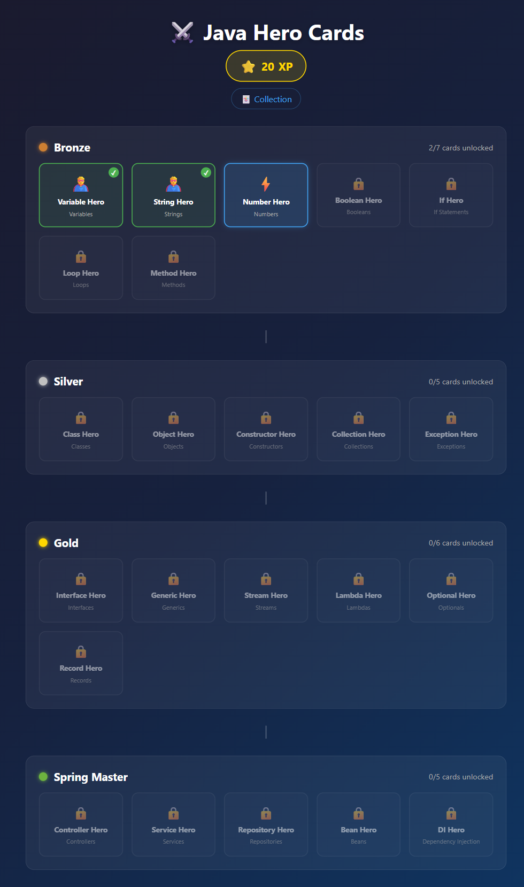
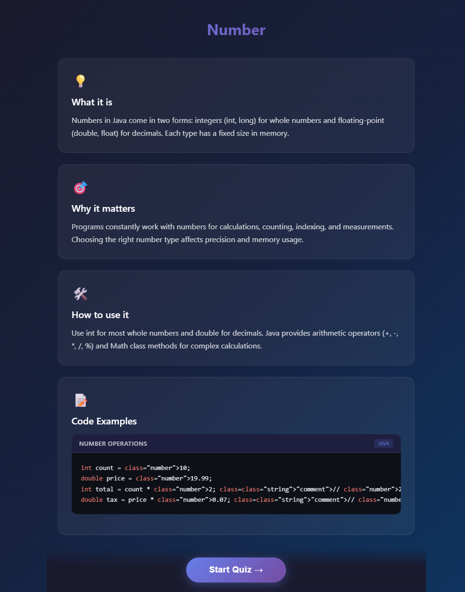
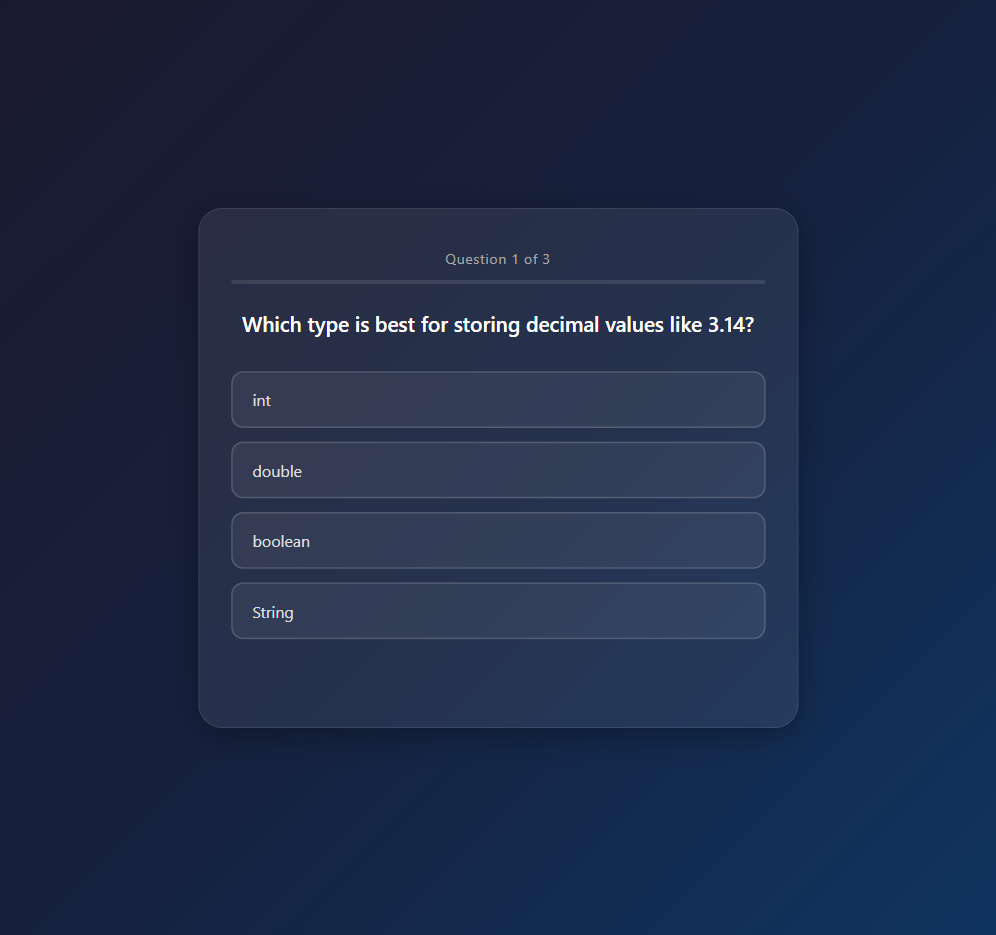
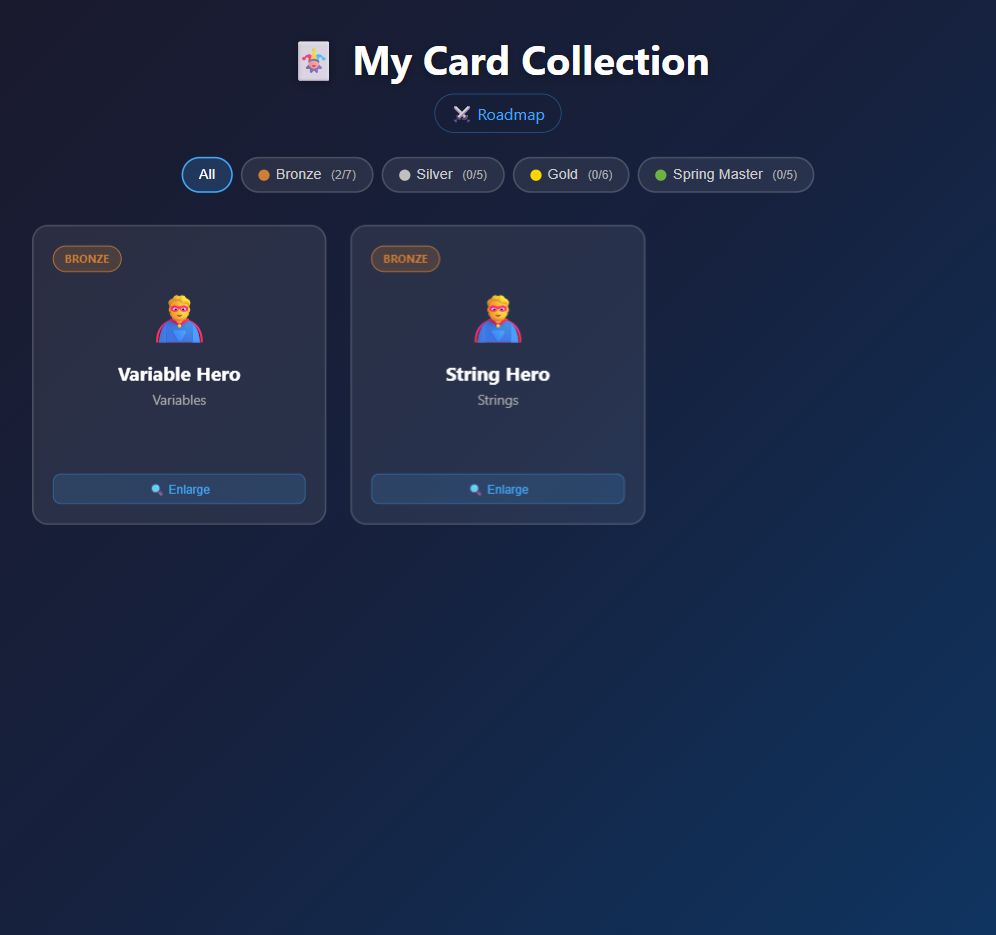

# Java Hero Cards 🃏☕

[](https://youtube.com/live/Vp5AspPXN-4)

> **Built live on stream!** This project was created during a live coding session. Watch the full recording here:
> [https://youtube.com/live/Vp5AspPXN-4](https://youtube.com/live/Vp5AspPXN-4)

## What is Java Hero Cards?

A gamified web application that teaches Java and Spring concepts through collectible hero cards. Players progress through sequential learning paths, unlocking cards by completing quizzes about programming topics. Each card represents a concept — from basic variables all the way to Spring dependency injection.

## Core Mechanics

- **Learning Paths** — Four tiered paths with increasing difficulty: Bronze → Silver → Gold → Spring Master
- **Hero Cards** — Collectible cards tied to programming concepts, unlocked sequentially
- **Quizzes** — Multiple-choice questions that must all be answered correctly to unlock a card
- **XP System** — Experience points awarded per unlock, varying by tier (10 / 20 / 30 / 50)
- **Onboarding** — Animated introduction for new players

## Learning Paths

| Path | Cards | XP per Card |
|------|-------|-------------|
| 🥉 Bronze | Variable, String, Number, Boolean, If, Loop, Method | 10 |
| 🥈 Silver | Class, Object, Constructor, Collection, Exception | 20 |
| 🥇 Gold | Interface, Generic, Stream, Lambda, Optional, Record | 30 |
| 🏆 Spring Master | Controller, Service, Repository, Bean, Dependency Injection | 50 |

## Screenshots

### Roadmap — Learning Paths & Progression


### Learning — Hero Card Content


### Quiz — Test Your Knowledge


### Collection — Your Unlocked Cards


## Tech Stack

- **Java 17** + **Spring Boot 3.4.1**
- **Spring Data JPA** with H2 in-memory database
- **Static frontend** — HTML, CSS, vanilla JavaScript (no framework)
- **Maven** build
- **jqwik** for property-based testing

## Getting Started

```bash
# Clone the repository
git clone <repo-url>
cd kiro-java-hero-game

# Build the project
mvn clean package

# Run the application
mvn spring-boot:run
```

The app starts on [http://localhost:8080](http://localhost:8080).

The H2 console is available at [http://localhost:8080/h2-console](http://localhost:8080/h2-console) (JDBC URL: `jdbc:h2:mem:herocardsdb`).

## Running Tests

```bash
# Run all tests (unit, integration, property-based)
mvn test
```

Tests include:
- **Unit tests** — Service layer logic
- **Integration tests** — REST API endpoints with MockMvc
- **Property-based tests** — Correctness properties verified with jqwik (100+ iterations per property)

## Project Structure

```
src/main/java/com/javahero/
├── config/          # Data initialization
├── controller/      # REST API controllers
├── dto/             # Request/response objects
├── exception/       # Custom exceptions
├── model/           # JPA entities and enums
├── repository/      # Spring Data JPA repositories
├── service/         # Business logic
└── JavaHeroCardsApplication.java

src/main/resources/
├── static/          # Frontend (HTML, CSS, JS)
└── application.properties

src/test/java/com/javahero/
├── controller/      # Integration tests
├── property/        # Property-based tests (jqwik)
└── service/         # Unit tests
```

## About This Project

This project was built during a **live coding session** to demonstrate how [Kiro](https://kiro.dev) works with spec-driven development. The entire application — from requirements and design documents to implementation and property-based tests — was developed live, showcasing an agentic engineering workflow.

Watch the session: [https://youtube.com/live/Vp5AspPXN-4](https://youtube.com/live/Vp5AspPXN-4)

## License

This project is for educational and demonstration purposes.
